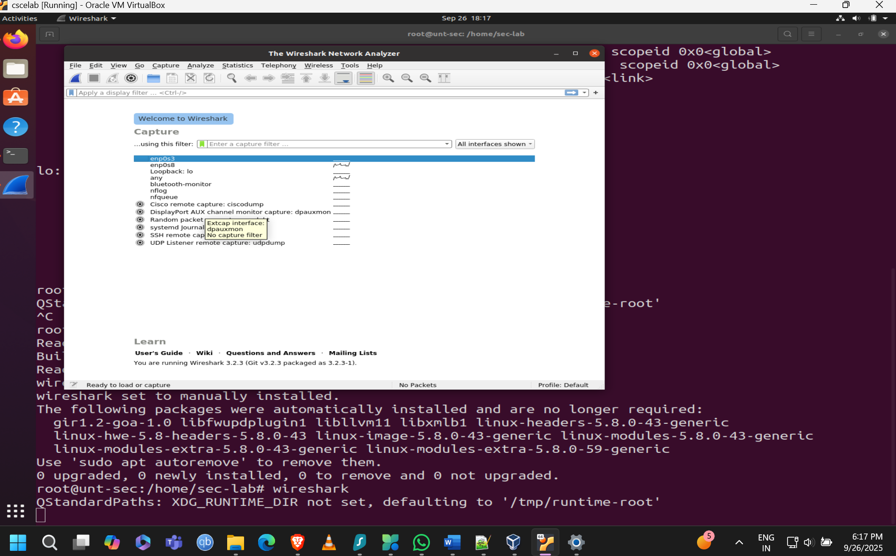
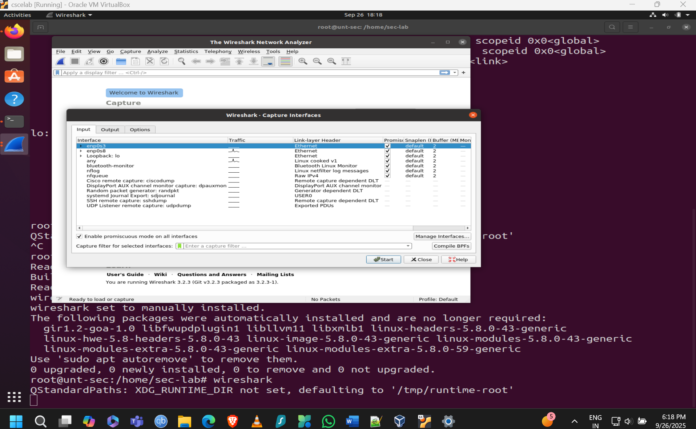
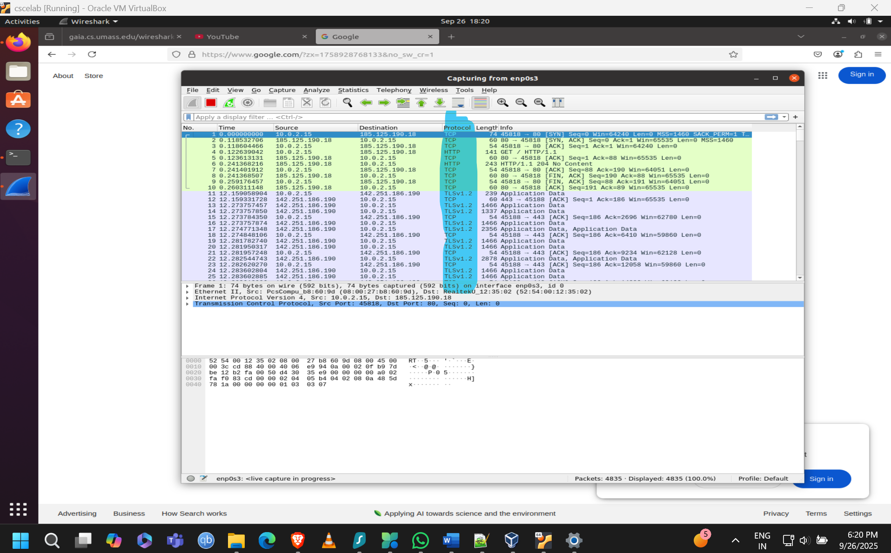
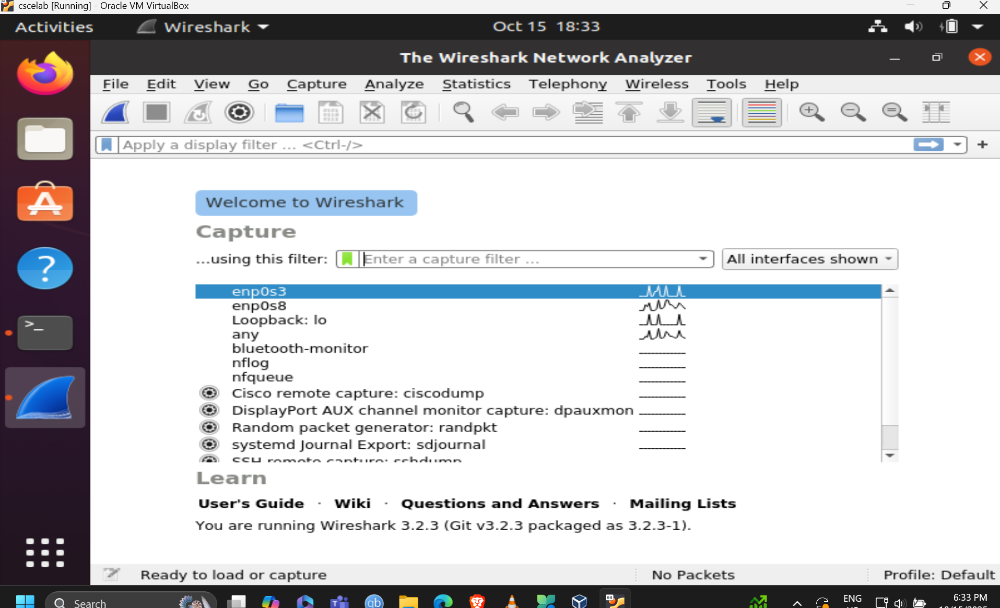
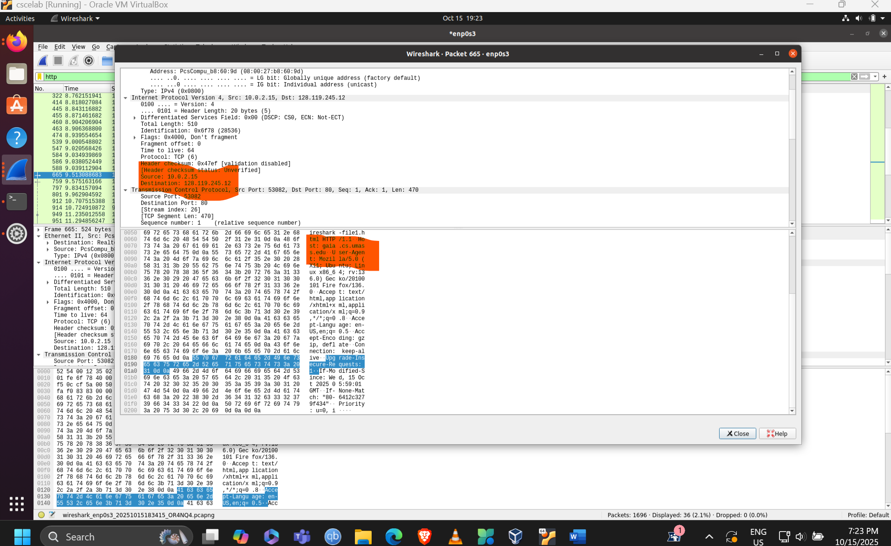
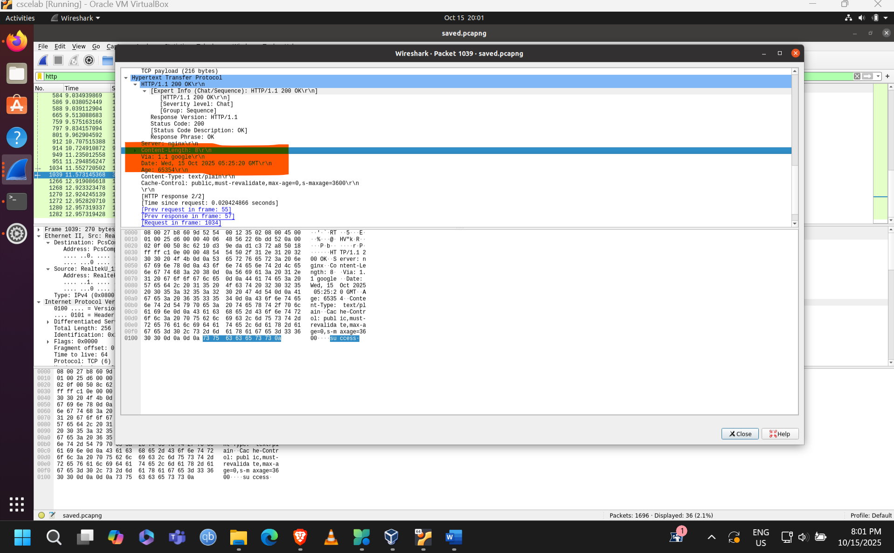
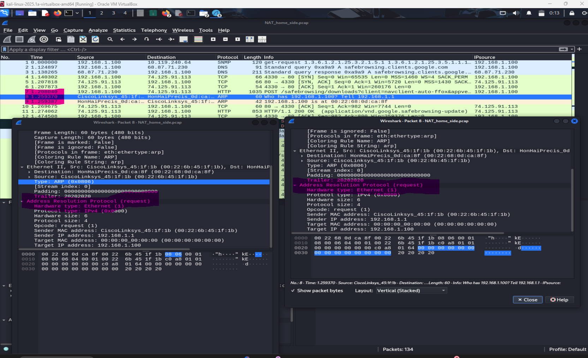

# Network Traffic Analysis Labs

This README consolidates multiple Wireshark-based network traffic analysis labs into one technical reference. It keeps only packet-analysis objectives, direct technical answers (where clearly supported by the provided materials), and screenshot evidence from captures.

---

# Lab 1 – Wireshark Installation and Basic Packet Analysis

## Topic Overview
This lab focuses on the foundations of packet analysis: installing Wireshark, selecting capture interfaces, recognizing protocol types, filtering traffic, and reading timing/address details from packets. These basics matter because every advanced troubleshooting workflow starts with accurate capture setup and packet interpretation.

## Objective / Question 1
Confirm that Wireshark is installed and interfaces are available for packet capture.

### Answer
Wireshark was installed successfully, and capture interfaces were detected and available.

### Screenshots

## Objective / Question 2
Identify major protocols visible during capture.

### Answer
The capture shows multiple protocols, including TCP, HTTP, and TLSv1.2. TCP provides reliable transport, HTTP carries web request/response traffic, and TLS secures encrypted sessions.

### Screenshots

## Objective / Question 3
Filter and inspect HTTP packets.

### Answer
HTTP filtering was applied successfully to isolate web traffic and inspect request/response packets.

### Screenshots

## Objective / Question 4
Measure timing between HTTP request and response.

### Answer
The measured time from HTTP GET to HTTP 200 OK response is **160.394953882 seconds**.

### Screenshots

## Objective / Question 5
Identify source and destination IP addresses from the HTTP packet.

### Answer
- Source IP: **10.0.2.15**
- Destination IP: **185.125.190.18**

### Screenshots

# Lab 2 – Wireshark HTTP Traffic

## Topic Overview
This lab explores HTTP behavior in detail: request/response versions, headers, status codes, caching behavior, and authentication flow. These details matter because packet-level HTTP inspection helps explain web app behavior, failed logins, stale content, and client/server compatibility issues.

## Objective / Question 1
Determine HTTP versions used by client and server.

### Answer
Both the browser and server use **HTTP/1.1** based on request/response lines in the captured frames.

### Screenshots

## Objective / Question 2
Identify the browser language preference from HTTP headers.

### Answer
The `Accept-Language` header indicates: **en-US,en;q=0.5**.

### Screenshots

## Objective / Question 3
Identify client and server IP addresses for the HTTP exchange.

### Answer
- Client/source IP: **10.0.2.15**
- Server/destination IP (gaia.cs.umass.edu): **128.119.245.12**

### Screenshots

## Objective / Question 4
Identify HTTP status code returned by the server.

### Answer
Server response status: **304 Not Modified**.

### Screenshots

## Objective / Question 5
Find the `Last-Modified` value for the requested HTML object.

### Answer
The captured header shows:
- `Last-Modified: Wed, 15 Oct 2025 23:34:32 GMT`

### Screenshots

## Objective / Question 6
Find the content length returned by the server.

### Answer
The `Content-Length` field is present in the capture. The exact numeric value is not clearly extractable from the provided text artifacts.

### Screenshots

## Objective / Question 7
Identify the server response to the initial authentication attempt.

### Answer
Initial authentication response: **401 Unauthorized** with a `WWW-Authenticate: Basic realm="wireshark-students only"` challenge.

### Screenshots

## Objective / Question 8
Identify what new field appears in the second authenticated HTTP GET request.

### Answer
The second GET includes an `Authorization: Basic ...` header (Base64 credentials).

### Screenshots

# Lab 3 – Advanced Network Traffic Analysis (UDP, TCP, and VPN)

## Topic Overview
This lab targets transport-layer and secure tunnel analysis. In packet analysis, comparing UDP vs TCP behavior, finding retransmissions, and validating VPN traffic helps diagnose performance issues, packet loss, and encrypted tunnel correctness.

## Objective / Question 1
Analyze basic connectivity traffic (ICMP/ping capture).

### Answer
Answer currently not found clearly in the provided materials.

### Screenshots

## Objective / Question 2
Inspect TCP stream behavior and payload continuity.

### Answer
Answer currently not found clearly in the provided materials.

### Screenshots

## Objective / Question 3
Identify retransmission-related events in TCP analysis.

### Answer
Answer currently not found clearly in the provided materials.

### Screenshots

## Objective / Question 4
Verify VPN-related traffic or tunnel behavior.

### Answer
Answer currently not found clearly in the provided materials.

### Screenshots

# Lab 4 – NAT and Protocol Analysis

## Topic Overview
This lab emphasizes NAT behavior and packet field changes across endpoints. In packet analysis, NAT is critical because source/destination addresses and checksums can change in translation paths, affecting troubleshooting for TCP, UDP, and ICMP traffic.

## Objective / Question 1
Inspect NAT-side capture and identify translated traffic context.

### Answer
Answer currently not found clearly in the provided materials.

### Screenshots

## Objective / Question 2
Compare TCP port-level behavior across observed packets.

### Answer
Answer currently not found clearly in the provided materials.

### Screenshots

## Objective / Question 3
Review UDP header comparison points.

### Answer
Answer currently not found clearly in the provided materials.

### Screenshots

## Objective / Question 4
Inspect ICMP behavior in NAT-related traces.

### Answer
Answer currently not found clearly in the provided materials.

### Screenshots

# Lab 5 – Ethernet Frames and ARP Analysis

## Topic Overview
This lab focuses on link-layer packet interpretation: Ethernet framing, MAC addressing, EtherType usage, and ARP resolution. These are core skills for diagnosing local network issues such as host discovery failures, ARP cache problems, and LAN-level communication breakdowns.

## Objective / Question 1
Identify Ethernet frame structure in captured packets.

### Answer
Answer currently not found clearly in the provided materials.

### Screenshots

## Objective / Question 2
Identify source/destination MAC address details.

### Answer
Answer currently not found clearly in the provided materials.

### Screenshots

## Objective / Question 3
Inspect EtherType-related frame identification.

### Answer
Answer currently not found clearly in the provided materials.

### Screenshots

## Objective / Question 4
Review ARP packet field details.

### Answer
Answer currently not found clearly in the provided materials.

### Screenshots

## Objective / Question 5
Examine ARP request/response behavior.

### Answer
Answer currently not found clearly in the provided materials.

### Screenshots

## Objective / Question 6
Correlate ARP exchange evidence in capture.

### Answer
Answer currently not found clearly in the provided materials.

### Screenshots

